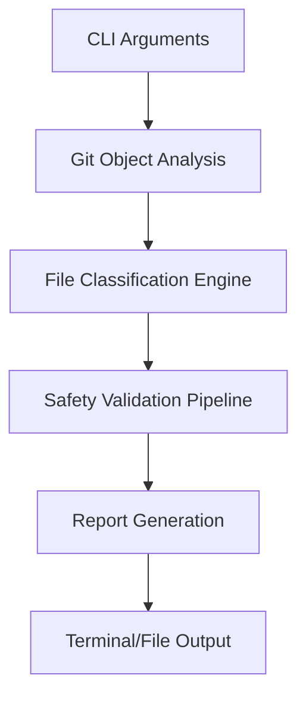

# 🔍 Git Subtree Analyzer & Reporter [](LICENSE.md) [](LICENSE.md)

**Zero-Footprint Git Repository Analysis Tool**
*See into your repository's soul without checking out files!*

## 📖 Table of Contents
- [🚀 Features](#-features)
- [🛠️ Installation](#️-installation)
- [💡 Usage](#-usage)
- [📊 Report Examples](#-report-examples)
- [🔧 Dependencies](#-dependencies)
- [❓ Why Use This?](#-why-use-this)
- [🧠 Technical Details](#-technical-details)
- [🤝 Contributing](#-contributing)
- [⚖️ License](#️-license)

## 🚀 Features

✨ **Powerful Insights in Your Terminal**
✔️ Full repository/subtree visualization
✔️ Concatenation safety checks (null bytes, invalid UTF-8)
✔️ Size analysis with LFS tracking
✔️ Submodule & symlink detection

⚡ **Performance Optimized**
✅ Works with multi-GB repositories
✅ No working directory required
✅ Parallel processing where possible

🔒 **Safety First**
✔️ Pure read-only operations
✔️ Strict input validation
✔️ Clean error handling

## 🛠️ Installation

### Basic Installation
```bash
git clone https://github.com/da2ce7/git-subtree-report.git
cd git-subtree-report/src
chmod +x git_subtree_report.sh
```

### Meson Build System
```bash
# Install Meson build system if needed
python3 -m pip install meson ninja

# Configure and install
meson setup build
meson compile -C build
meson install -C build

# Custom install location
meson setup build --prefix ~/.local
meson install -C build
```

### System-Wide Install (Optional)
```bash
# Manual installation
sudo cp git_subtree_report.sh /usr/local/bin/git-subtree-report

# Create distribution package
meson dist -C build --formats gztar
```

## 💡 Usage

### Command Options
| Option | Description                                  | Example             |
|--------|----------------------------------------------|---------------------|
| `-e`   | Exclude files by regex                       | `-e '\.log$'`       |
| `-r`   | Git reference (commit/branch/tag)            | `-r develop`        |
| `-C`   | Working directory                            | `-C /path/to/repo`  |
| `-o`   | Output concatenated safe files               | `-o`                |
| `-t`   | Subtree path to analyze                      | `-t docs/`          |
| `-s`   | Max file size for analysis                   | `-s 10M`            |

### Basic Example
```bash
./git_subtree_report.sh -C my-repo -t src/ -e 'test_' -s 5M
```

### Advanced Usage
```bash
# Analyze last month's commits in CI/CD pipeline
git-subtree-report -C "${BUILD_DIR}" \
  -r "$(git rev-list -n1 --since='1 month ago')" \
  -t infrastructure/ \
  -e '\.secret$' \
  -o | tee -a safety-audit-$(date +%Y%m%d).log
```

## 📊 Report Examples

### Standard Report
```bash
$ git-subtree-report 1> examples/repo_commit.txt 2> examples/repo_commit.log
```
[Repo Commit Report](https://github.com/da2ce7/git-subtree-report/examples/repo_commit.txt)
[Repo Commit Log](https://github.com/da2ce7/git-subtree-report/examples/repo_commit.log)

### Concatenation Mode
```bash
git-subtree-report -o -t docs/ | less -R
```
Outputs clean concatenation of all safe text files with visual separators

## 🔧 Dependencies

**Core Requirements**
- `Bash 5.0+` - Modern shell features
- `Git 2.20+` - Repository analysis
- `Perl 5.10+` - Advanced text processing

**Recommended**
- `less` with `-R` support for colored output
- `terminal-notifier` for macOS desktop alerts

## ❓ Why Use This?

**Perfect For**
- Pre-commit safety checks
- CI/CD pipeline analysis
- Documentation validation
- Security audits of stored files
- Repository migration planning

**Competitive Advantage**
🕵️ _Unlike simple `git ls-files`:_
- Deep content analysis without checkouts
- Hidden relationship discovery (LFS, submodules)
- Concatenation-ready output formatting
- Historical analysis at any commit

## 🧠 Technical Details

### Architecture Overview


### Performance Metrics
It should be okay.

## 🤝 Contributing

**We Welcome**
🐛 Bug Reports   💡 Feature Ideas   📖 Documentation   🛠️ Code Contributions

**Development Setup**
```bash
git clone --recurse-submodules https://github.com/da2ce7/git-subtree-report.git
cd git-subtree-report
pre-commit install
```

**Testing**
```bash
./test/run_tests.sh --suite=full
```

## ⚖️ License

This project is licensed under the **GNU Affero General Public License v3.0**
[Full License Text](LICENSE.md) • [AGPLv3 Explained](https://www.gnu.org/licenses/agpl-3.0.en.html)

---

**Maintained with ❤️ by [Cameron Garnham](https://da2ce7.com) and AI**
_Open Source Sustainability Sponsor Program Available_
