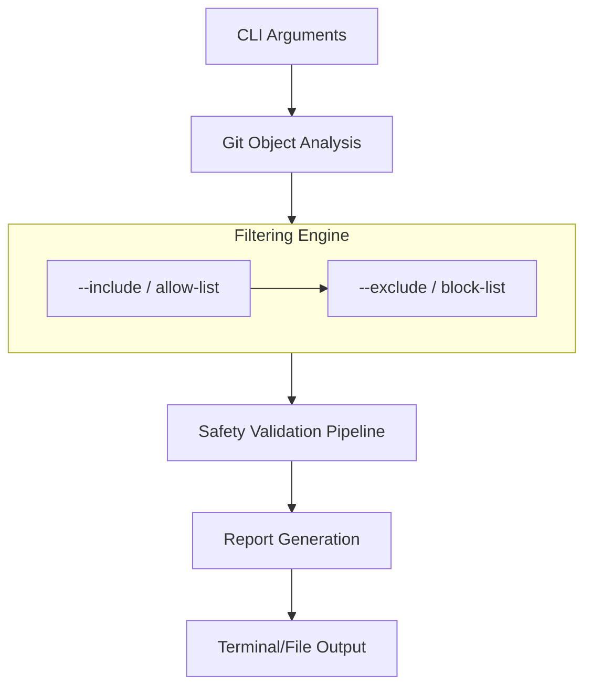

# 🔍 Git Subtree Analyzer & Reporter [](LICENSE.md) [](LICENSE.md)

**Zero-Footprint Git Repository Analysis Tool**
*See into your repository's soul without checking out files!*

## 📖 Table of Contents
- [🚀 Features](#-features)
- [🛠️ Installation](#️-installation)
- [💡 Usage](#-usage)
- [📊 Report Examples](#-report-examples)
- [🔧 Dependencies](#-dependencies)
- [❓ Why Use This?](#-why-use-this)
- [🧠 Technical Details](#-technical-details)
- [🤝 Contributing](#-contributing)
- [⚖️ License](#️-license)

## 🚀 Features

✨ **Powerful Insights in Your Terminal**
✔️ Two-stage filtering (include then exclude)
✔️ Full repository/subtree visualization
✔️ Concatenation safety checks (null bytes, invalid UTF-8)
✔️ Size analysis with LFS tracking
✔️ Submodule & symlink detection

⚡ **Performance Optimized**
✅ Works with multi-GB repositories
✅ No working directory required
✅ Parallel processing where possible

🔒 **Safety First**
✔️ Pure read-only operations
✔️ Strict input validation
✔️ Clean error handling

## 🛠️ Installation
**Windows Note:** Requires Git Bash/WSL2 for full functionality

### Basic Installation
```bash
git clone https://github.com/da2ce7/git-subtree-report.git
cd git-subtree-report

# Local Installation (ensure that `~/.local/bin` is in your $PATH)
install -Dm755 bin/git_subtree_report.sh ~/.local/bin/git-subtree-report-1

# System Installation
sudo install -m 0755 bin/git_subtree_report.sh /usr/local/bin/git-subtree-report-1
```

### Meson Build System (preferred)
```bash
# Install Meson (Ubuntu)
sudo apt install meson

# Install Meson (Fedora)
sudo dnf install meson

# Local Configure (ensure that `~/.local/bin` is in your $PATH)
meson setup build --prefix ~/.local

# System Configure
meson setup build

# Build
meson compile -C build
meson install -C build
```

### Create distribution package
```bash
meson dist -C build --formats gztar
```

## 💡 Usage

### Command Options

| Option                    | Description                                                              | Default                 |
|---------------------------|--------------------------------------------------------------------------|-------------------------|
| `-C, --working-dir <DIR>` | Change to directory `<DIR>` before running analysis.                     | `.` (current directory) |
| `-i, --include <PATTERN>` | Only include files matching an ERE (allow-list). Applied before exclude. | (none)                  |
| `-e, --exclude <PATTERN>` | Exclude files from the included set matching an ERE (block-list).        | (none)                  |
| `-h, --help`              | Display a detailed help message and exit.                                | (N/A)                   |
| `-o, --output-concat`     | Enable concatenated output of all safe text files.                       | Disabled                |
| `-r, --ref <REF>`         | Git reference (commit, branch, tag) to analyze.                          | `HEAD`                  |
| `-s, --max-size <SIZE>`   | Set max file size for content analysis (e.g., `1M`, `500K`).             | `1M`                    |
| `-t, --subtree <PATH>`    | Relative path of the subdirectory to analyze.                            | `.` (from within repo)  |
| `--version`               | Display version information and exit.                                    | (N/A)                   |

### Filtering Logic

The script applies filters in a two-stage process for powerful and precise file selection:

1.  **Inclusion (`--include`)**: First, an "allow-list" is created. If `--include` is used, only files matching the pattern are kept. If it's not used, all files in the subtree are kept.
2.  **Exclusion (`--exclude`)**: Next, the `--exclude` pattern is run against the results of the inclusion stage. Any files from that set matching the exclusion pattern are removed.

`All Files in Subtree` → `[--include Filter]` → `Intermediate Set` → `[--exclude Filter]` → `Final Set for Analysis`

### Basic Example
```bash
# Analyzes the 'src/' directory, first including only C/C++ source files,
# then excluding any of those that are in a 'test/' subdirectory.
git-subtree-report-1 -t src/ -i '\.(c|cpp|h)$' -e '/test/'
```

### Advanced Usage
```bash
# Analyze last month's commits in CI/CD pipeline, excluding secrets
git-subtree-report-1 -C "${BUILD_DIR}" \
  -r "$(git rev-list -n1 --since='1 month ago')" \
  -t infrastructure/ \
  -e '\.secret$' \
  -o | tee -a safety-audit-$(date +%Y%m%d).log
```

## 📊 Report Examples

### Standard Report
```bash
$ git-subtree-report-1 1> examples/repo_commit.txt 2> examples/repo_commit.log
```
[Repo Commit Report](https://github.com/da2ce7/git-subtree-report/blob/main/examples/repo_commit.txt)
[Repo Commit Log](https://github.com/da2ce7/git-subtree-report/blob/main/examples/repo_commit.log)

*Note: As of v1.6.0, the report includes a detailed **`NAME-BASED FILTERING REPORT`** section that breaks down which files were selected or rejected by the `--include` and `--exclude` filters.*

### Concatenation Mode
```bash
git-subtree-report-1 -o -t docs/ | less -R
```
Outputs clean concatenation of all safe text files with visual separators

## 🔧 Dependencies

**Core Requirements**
- `Bash 5.0+` - Modern shell features
- `Git 2.20+` - Repository analysis
- `Perl 5.10+` - Advanced text processing

**Recommended**
- `less` with `-R` support for colored output
- `terminal-notifier` for macOS desktop alerts

## ❓ Why Use This?

**Perfect For**
- Pre-commit safety checks
- CI/CD pipeline analysis
- Documentation validation
- Security audits of stored files
- Repository migration planning

**Competitive Advantage**
🕵️ _Unlike simple `git ls-files`:_
- Deep content analysis without checkouts
- Hidden relationship discovery (LFS, submodules)
- Concatenation-ready output formatting
- Historical analysis at any commit

## 🧠 Technical Details

### Architecture Overview


### Performance Metrics
It should be okay.

## 🤝 Contributing

**We Welcome**
🐛 Bug Reports   💡 Feature Ideas   📖 Documentation   🛠️ Code Contributions

**Development Setup**
```bash
git clone --recurse-submodules https://github.com/da2ce7/git-subtree-report.git
cd git-subtree-report
pre-commit install
```

**Testing**
```bash
./test/run_tests.sh --suite=full
```

## ⚖️ License

This project is licensed under the **GNU Affero General Public License v3.0**
[Full License Text](LICENSE.md) • [AGPLv3 Explained](https://www.gnu.org/licenses/agpl-3.0.en.html)

---

**Maintained with ❤️ by [Cameron Garnham](https://da2ce7.com) and AI**
_Open Source Sustainability Sponsor Program Available_
