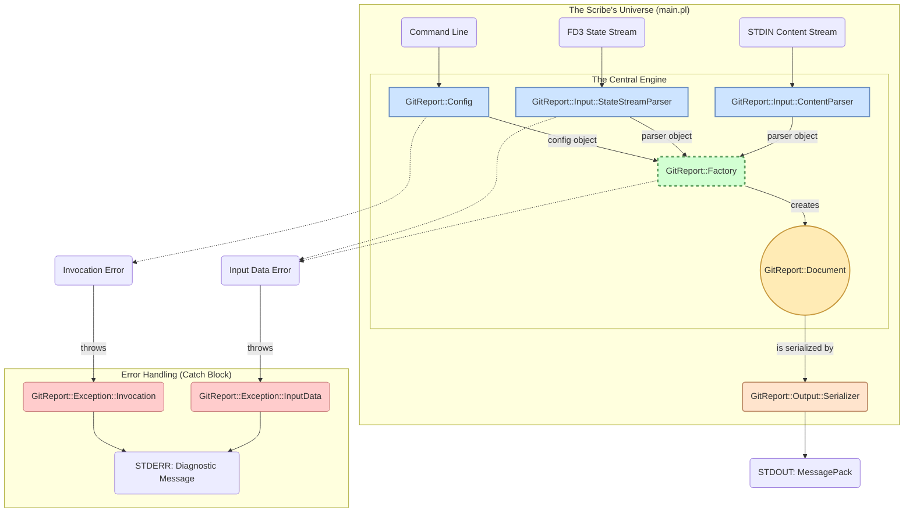

### I. The Guiding Principles

1.  **Single Responsibility:** Each class does one thing and does it flawlessly.
2.  **Immutability:** Data, once validated and created, should not be changed. This eliminates entire categories of bugs.
3.  **Dependency Injection:** Components should not create their dependencies; they should be given them. This makes the entire system profoundly testable.
4.  **Contracts, Not Chaos:** Objects communicate through well-defined methods and attributes, not by manipulating shared, untyped hashes.

### II. The Orrery: A Constellation of Classes

Instead of a single flow, imagine our application as an orrery—a mechanical model of the solar system. At its center is the ultimate artifact, orbited by the components that create it.



### III. The Classes: Defining the Gears

#### 1. `GitReport::Config` — The Governor

This class is the gatekeeper of user intent. Its sole purpose is to consume the raw command-line arguments and produce a validated, immutable configuration object.

*   **Role:** An immutable data object.
*   **Constructor (`new`):** Takes `@ARGV` as input. It uses `Getopt::Long` internally. If validation passes, it creates an immutable object.
*   **Attributes:** `commit_hash`, `timestamp_utc`, `embed_content`, etc. Each attribute will have type constraints (e.g., `Str`, `Bool`, `Int`).
*   **Behavior:** If any validation fails (missing option, bad format), the constructor **throws a `GitReport::Exception::Invocation` object**. It doesn't return; it fails atomically.
*   **Elegance:** You can no longer have a partially-valid configuration floating around your program. An object of this class is, by definition, valid.

#### 2. `GitReport::Input::StateStreamParser` — The Archaeologist

This class knows how to read the arcane, null-delimited language of the `BASH_STATE_STREAM`.

*   **Role:** A data parser.
*   **Constructor (`new`):** Takes a filehandle (for FD 3) as its input.
*   **Method (`parse`):** Reads the stream, splits on `\0`, and transforms the flat list into a structured Perl hash. It validates the stream's integrity (must be a multiple of 3, must contain core keys). On failure, it **throws a `GitReport::Exception::InputData` object**.
*   **Elegance:** All the messy, error-prone logic of parsing an external data format is now isolated in one place. The rest of the application simply asks it for the parsed data and trusts its output. It is independently testable with mock filehandles.

#### 3. `GitReport::Factory` — The Master Craftsman

This is the central coordinating class. It knows how to take the raw materials—the config and parsed data—and orchestrate the construction of the final report.

*   **Role:** A builder/factory.
*   **Constructor (`new`):** Takes a `GitReport::Config` object and a `...::StateStreamParser` object as its dependencies (Dependency Injection).
*   **Method (`create_document`):** This method contains the core "transformation" logic. It queries the config and parser objects to build the final, deeply nested data structure. It then uses this structure to instantiate and return an immutable `GitReport::Document` object.
*   **Elegance:** The complex logic of assembling the final report is no longer a giant function but the primary responsibility of a dedicated class.

#### 4. `GitReport::Document` — The Immutable Artifact

This class *is* the report. It's a read-only object representing the final, perfect state of our data before serialization.

*   **Role:** An immutable data transfer object (DTO).
*   **Constructor (`new`):** Is called only by the `GitReport::Factory`. It takes the fully formed hash as input and blesses it into an object.
*   **Attributes:** `metadata`, `summary`, `results`. These are read-only.
*   **Methods:** `metadata()`, `summary()`, `results()`, and perhaps a convenience method `as_hash()` for serialization.
*   **Elegance:** Passing this object around is safe. No downstream function can accidentally modify the report data. Its state is guaranteed from the moment of its creation.

#### 5. `GitReport::Output::Serializer` — The Emissary

This class understands how to speak MessagePack.

*   **Role:** A data serializer.
*   **Method (`serialize($document, $handle)`):** A class method that takes a `GitReport::Document` object and a filehandle (STDOUT). It gets the data via `$document->as_hash()`, packs it into a binary string using `Data::MessagePack`, and prints it to the handle. It also prints the success message to STDERR.
*   **Elegance:** Separates the final act of serialization from the logic of creating the data.

#### 6. `GitReport::Exception` — The Voice of Failure (A Role)

This is a `Moo::Role` that defines the interface for our custom exceptions. Other classes will consume this role.

*   **Role:** An exception object contract.
*   **Attributes:** `message` (Str), `exit_code` (Int).
*   **Example Classes:** `GitReport::Exception::Invocation` and `GitReport::Exception::InputData` will `with 'GitReport::Exception'`.

### IV. The Refined `main.pl`: A Symphony of Objects

With these abstractions, our main entrypoint becomes a thing of beauty. It reads like a high-level story, its complexity elegantly hidden within the gears of our engine.

```perl
#!/usr/bin/env perl
use v5.36;
use try_tiny; # A robust try/catch implementation from CPAN
use lib 'lib'; # Tell Perl where to find our new classes

# --- Import our elegant abstractions ---
use GitReport::Config;
use GitReport::Input::StateStreamParser;
use GitReport::Factory;
use GitReport::Output::Serializer;
use GitReport::Exception; # Loads the role and exception classes
use IO::Handle;

sub main() {
    try {
        # 1. Govern: Create the validated configuration object.
        # This will throw GitReport::Exception::Invocation on failure.
        my $config = GitReport::Config->new(args => \@ARGV);

        # 2. Ingest: Create the parsers for our input streams.
        my $state_parser = GitReport::Input::StateStreamParser->new(
            handle => IO::Handle->new_from_fd(3, 'r')
        );
        # A content parser would be created here if needed.

        # 3. Create: Instantiate the factory and ask it to build the document.
        # This is where all the raw parts are assembled into a coherent whole.
        my $factory = GitReport::Factory->new(
            config => $config,
            state_parser => $state_parser,
        );
        my $document = $factory->create_document();

        # 4. Serialize: Hand the final, perfect artifact to the emissary.
        GitReport::Output::Serializer->serialize(
            document => $document,
            handle   => \*STDOUT,
        );

    } catch {
        # The unified error handler. It catches our custom exception objects.
        if (blessed($_) && $_->does('GitReport::Exception')) {
            # Adhere to the ICD: print the message and exit with the code.
            say STDERR "FATAL: " . $_->message;
            exit $_->exit_code;
        }
        # Catch-all for truly unexpected bugs.
        say STDERR "FATAL: An unhandled internal error occurred: $_";
        exit 1; # The generic bug exit code
    };
}

main();
```

This design is the embodiment of Modern Perl elegance. It transforms a fragile, procedural script into a robust, testable, and deeply readable system of cooperating objects. We have not just designed a script; we have designed a small, perfect universe.